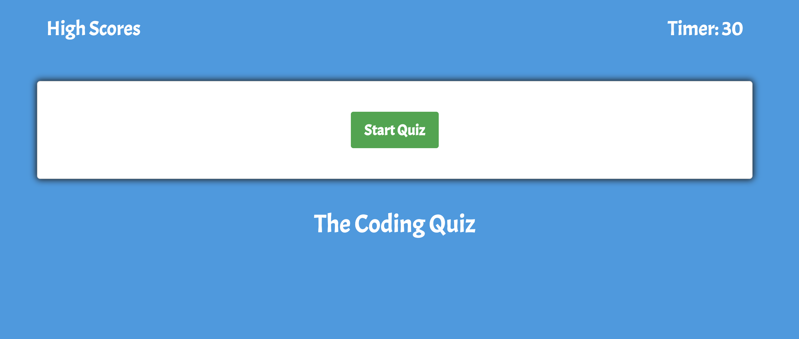
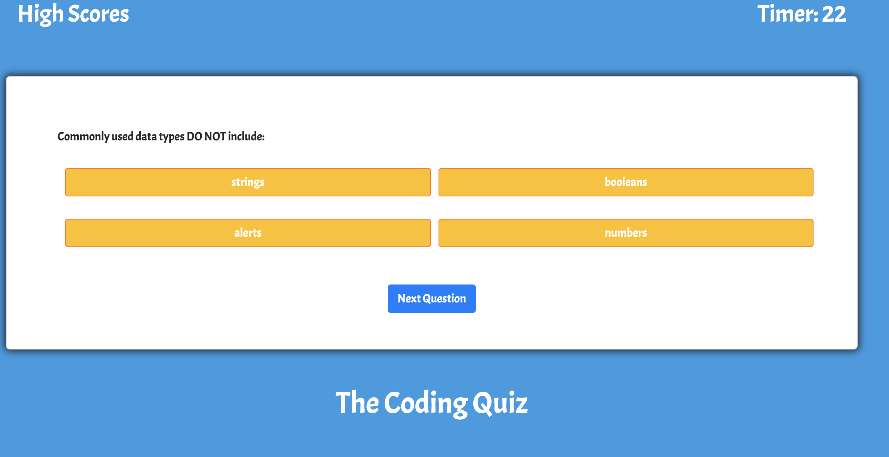
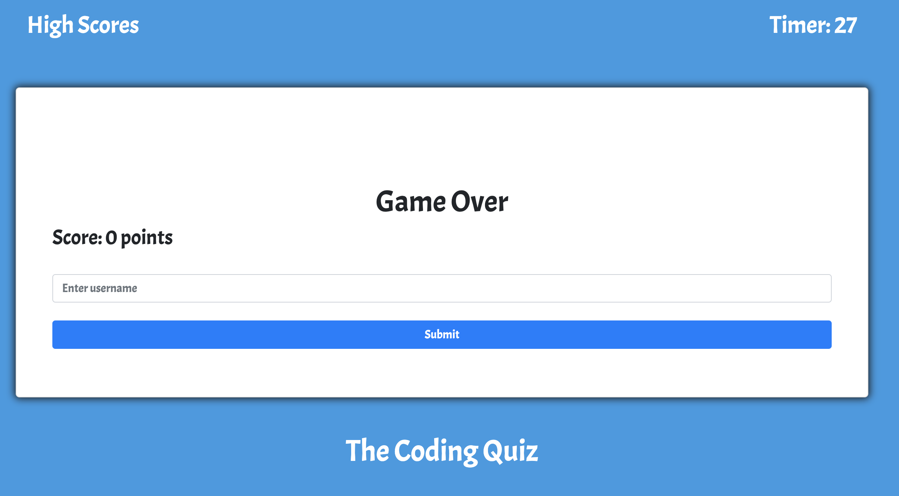

# Tyler's Multipl Choice Code Quiz

This is a application that will test the users knowlege of code. The user will see a green button to start the quiz. There will be five questions. If the user gets a answer correct the background will show green and will be awarded 10 points and if the user guess wrong the background will be red and will be awarded no points. The user only has 30 seconds to complete this quiz. At the end of the quiz the user will submit their user name and score to the high scores list. The user can restart the quiz after they submit their name.

 
 
          

## Getting Started

These instructions will get you a started with how to build a random password generator.

### Prerequisites

```
Text editor of your choosing, internet connection
```

## Built With
```
* HTML
* CSS
* Javascript
* Bootstrap framework
* JQuery

```

## Links to Wesbsite 

- https://mr-tyler31.github.io/MultipleChoice_Game/


## Resources

- https://developer.mozilla.org/en-US/docs/Web/JavaScript
- https://www.w3schools.com/
- https://getbootstrap.com/docs/4.3/getting-started/introduction/
- https://stackoverflow.com/

